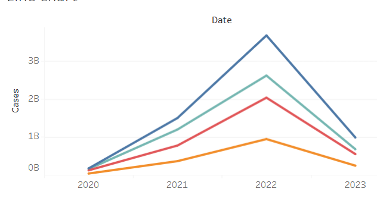

# covid19-dashboard
Tableau dashboard visualizing Covid-19 cases and deaths by state.

# COVID-19 Cases and Deaths Dashboard (U.S.)

## 📊 Overview
This Tableau dashboard visualizes COVID-19 cases and deaths across U.S. states from 2020–2023. It includes trends over time, total impact by geography, and ranked state comparisons.

##  Features
-  **Line Chart:** Case trends over time for selected states
- 🗺 **Map:** Total confirmed cases by state, color-coded by severity
-  **Bar Chart:** States ranked by total COVID-19 deaths
-  Filtered by most recent date available

##  Tools Used
- Tableau Public
- NYT COVID-19 Data (`us-states.csv`)

##  Live Dashboard
View the interactive dashboard here:  
🔗 [COVID-19 Tableau Dashboard](https://public.tableau.com/shared/B459P2RS3?:display_count=n&:origin=viz_share_link)

## 📷 Screenshots (optional)
_You can add dashboard images here by uploading `.png` files and embedding them like this:_

```markdown

